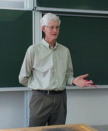

<table class="infobox biography vcard">
<tbody>
<tr>
<th colspan="2">

Stephen Cook

</th>
</tr>
<tr>
<td colspan="2">

Cook in 2008

</td>
</tr>
<tr>
<th scope="row">Born</th>
<td>

Stephen Arthur Cook

 December 14, 1939&nbsp;(age&nbsp;80) 

<a title="Buffalo, New York" href="https://en.wikipedia.org/wiki/Buffalo,_New_York">Buffalo</a>,&nbsp;<a title="New York (state)" href="https://en.wikipedia.org/wiki/New_York_(state)">New York</a>

</td>
</tr>
<tr>
<th scope="row">Alma&nbsp;mater</th>
<td><a title="Harvard University" href="https://en.wikipedia.org/wiki/Harvard_University">Harvard University</a> <a title="University of Michigan" href="https://en.wikipedia.org/wiki/University_of_Michigan">University of Michigan</a></td>
</tr>
<tr>
<th scope="row">Known&nbsp;for</th>
<td><a class="mw-redirect" title="NP-complete" href="https://en.wikipedia.org/wiki/NP-complete">NP-completeness</a> Propositional&nbsp;<a title="Proof complexity" href="https://en.wikipedia.org/wiki/Proof_complexity">proof complexity</a> <a class="mw-redirect" title="Cook-Levin theorem" href="https://en.wikipedia.org/wiki/Cook-Levin_theorem">Cook-Levin theorem</a></td>
</tr>
<tr>
<th scope="row">Awards</th>
<td><a title="Turing Award" href="https://en.wikipedia.org/wiki/Turing_Award">Turing Award</a>&nbsp;<small>(1982)</small> <a title="CRM-Fields-PIMS prize" href="https://en.wikipedia.org/wiki/CRM-Fields-PIMS_prize">CRM-Fields-PIMS prize</a>&nbsp;<small>(1999)</small> <a title="John L. Synge Award" href="https://en.wikipedia.org/wiki/John_L._Synge_Award">John L. Synge Award</a>&nbsp;<small>(2006)</small> <a class="new" title="Bernard Bolzano Medal (page does not exist)" href="https://en.wikipedia.org/w/index.php?title=Bernard_Bolzano_Medal&amp;action=edit&amp;redlink=1">Bernard Bolzano Medal</a> <a title="Gerhard Herzberg Canada Gold Medal for Science and Engineering" href="https://en.wikipedia.org/wiki/Gerhard_Herzberg_Canada_Gold_Medal_for_Science_and_Engineering">Gerhard Herzberg Canada Gold Medal for Science and Engineering</a>&nbsp;<small>(2012)</small> <a title="Order of Canada" href="https://en.wikipedia.org/wiki/Order_of_Canada">Officer of Order of Canada</a>&nbsp;<small>(2015)</small> <a class="mw-redirect" title="BBVA Foundation Frontiers of Knowledge Award" href="https://en.wikipedia.org/wiki/BBVA_Foundation_Frontiers_of_Knowledge_Award">BBVA Foundation Frontiers of Knowledge Award</a>&nbsp;<small>(2015)</small></td>
</tr>
<tr>
<td colspan="2"><strong>Scientific career</strong></td>
</tr>
<tr>
<th scope="row">Fields</th>
<td class="category"><a class="mw-redirect" title="Computer Science" href="https://en.wikipedia.org/wiki/Computer_Science">Computer Science</a></td>
</tr>
<tr>
<th scope="row">Institutions</th>
<td><a title="University of Toronto" href="https://en.wikipedia.org/wiki/University_of_Toronto">University of Toronto</a> <a title="University of California, Berkeley" href="https://en.wikipedia.org/wiki/University_of_California,_Berkeley">University of California, Berkeley</a></td>
</tr>
<tr>
<th scope="row"><a title="Thesis" href="https://en.wikipedia.org/wiki/Thesis">Thesis</a></th>
<td><em>On the Minimum Computation Time of Functions</em>&nbsp;(1966)</td>
</tr>
<tr>
<th scope="row"><a title="Doctoral advisor" href="https://en.wikipedia.org/wiki/Doctoral_advisor">Doctoral advisor</a></th>
<td><a title="Hao Wang (academic)" href="https://en.wikipedia.org/wiki/Hao_Wang_(academic)">Hao Wang</a></td>
</tr>
<tr>
<th scope="row">Doctoral students</th>
<td><a title="Mark Braverman (mathematician)" href="https://en.wikipedia.org/wiki/Mark_Braverman_(mathematician)">Mark Braverman</a> <a title="Toniann Pitassi" href="https://en.wikipedia.org/wiki/Toniann_Pitassi">Toniann Pitassi</a> <a title="Walter Savitch" href="https://en.wikipedia.org/wiki/Walter_Savitch">Walter Savitch</a> <a class="mw-redirect" title="Arvind Gupta (academic)" href="https://en.wikipedia.org/wiki/Arvind_Gupta_(academic)">Arvind Gupta</a> <a title="Anna Lubiw" href="https://en.wikipedia.org/wiki/Anna_Lubiw">Anna Lubiw</a></td>
</tr>
</tbody>
</table>
 

<strong>Stephen Arthur Cook</strong>,&nbsp;<a title="Order of Canada" href="https://en.wikipedia.org/wiki/Order_of_Canada">OC</a>,&nbsp;<a title="Order of Ontario" href="https://en.wikipedia.org/wiki/Order_of_Ontario">OOnt</a>&nbsp;(born December 14, 1939) is an American-Canadian&nbsp;<a title="Computer science" href="https://en.wikipedia.org/wiki/Computer_science">computer scientist</a>&nbsp;and&nbsp;<a title="Mathematics" href="https://en.wikipedia.org/wiki/Mathematics">mathematician</a>&nbsp;who has made major contributions to the fields of&nbsp;<a title="Computational complexity theory" href="https://en.wikipedia.org/wiki/Computational_complexity_theory">complexity theory</a>&nbsp;and&nbsp;<a title="Proof complexity" href="https://en.wikipedia.org/wiki/Proof_complexity">proof complexity</a>. He is a&nbsp;<a class="mw-redirect" title="University professor" href="https://en.wikipedia.org/wiki/University_professor">university professor</a>&nbsp;at the&nbsp;<a title="University of Toronto" href="https://en.wikipedia.org/wiki/University_of_Toronto">University of Toronto</a>,&nbsp;<a class="mw-redirect" title="Department of Computer Science (University of Toronto)" href="https://en.wikipedia.org/wiki/Department_of_Computer_Science_(University_of_Toronto)">Department of Computer Science</a>&nbsp;and&nbsp;<a title="University of Toronto Department of Mathematics" href="https://en.wikipedia.org/wiki/University_of_Toronto_Department_of_Mathematics">Department of Mathematics</a>.

 

<h2> Publications </h2>

<ul>

 <li><a target="_blank" href="https://github.com/manjunath5496/Stephen-A-Cook-Publications/blob/master/scook(1).pdf" style="text-decoration:none;">Relativizing Small Complexity Classes and their Theories</a></li>

 <li><a target="_blank" href="https://github.com/manjunath5496/Stephen-A-Cook-Publications/blob/master/scook(2).pdf" style="text-decoration:none;">The Hardness of Being Private</a></li>

<li><a target="_blank" href="https://github.com/manjunath5496/Stephen-A-Cook-Publications/blob/master/scook(3).pdf" style="text-decoration:none;">A Formal Theory for the Complexity Class Associated with the Stable Marriage Problem</a></li>
 <li><a target="_blank" href="https://github.com/manjunath5496/Stephen-A-Cook-Publications/blob/master/scook(4).pdf" style="text-decoration:none;">Complexity Classes and Theories for the Comparator Circuit Value Problem</a></li>                              
<li><a target="_blank" href="https://github.com/manjunath5496/Stephen-A-Cook-Publications/blob/master/scook(5).pdf" style="text-decoration:none;">New Results for Tree Evaluation</a></li>
<li><a target="_blank" href="https://github.com/manjunath5496/Stephen-A-Cook-Publications/blob/master/scook(6).pdf" style="text-decoration:none;">Complexity Theory for Operators in Analysis</a></li>
 <li><a target="_blank" href="https://github.com/manjunath5496/Stephen-A-Cook-Publications/blob/master/scook(7).pdf" style="text-decoration:none;">Bounded Reverse Mathematics</a></li>

 <li><a target="_blank" href="https://github.com/manjunath5496/Stephen-A-Cook-Publications/blob/master/scook(8).pdf" style="text-decoration:none;"> Formalizing Randomized Matching Algorithms</a></li>
   <li><a target="_blank" href="https://github.com/manjunath5496/Stephen-A-Cook-Publications/blob/master/scook(9).pdf" style="text-decoration:none;">Connecting Complexity Classes, Weak Formal Theories, and Propositional Proof Systems</a></li>
  
   
 <li><a target="_blank" href="https://github.com/manjunath5496/Stephen-A-Cook-Publications/blob/master/scook(10).pdf" style="text-decoration:none;">The Complexity and Proof Complexity of the Comparator Circuit Value Problem</a></li>                              
<li><a target="_blank" href="https://github.com/manjunath5496/Stephen-A-Cook-Publications/blob/master/scook(11).pdf" style="text-decoration:none;">Theories for Subexponential-size Bounded-depth Frege Proofs</a></li>
<li><a target="_blank" href="https://github.com/manjunath5496/Stephen-A-Cook-Publications/blob/master/scook(12).pdf" style="text-decoration:none;">The Complexity of the Comparator Circuit Value Problem</a></li>
<li><a target="_blank" href="https://github.com/manjunath5496/Stephen-A-Cook-Publications/blob/master/scook(13).pdf" style="text-decoration:none;">A Survey of Classes of Primitive Recursive Functions</a></li>

<li><a target="_blank" href="https://github.com/manjunath5496/Stephen-A-Cook-Publications/blob/master/scook(14).pdf" style="text-decoration:none;">The Complexity of Theorem Proving Procedures</a></li>
                              
<li><a target="_blank" href="https://github.com/manjunath5496/Stephen-A-Cook-Publications/blob/master/scook(15).pdf" style="text-decoration:none;">Time Bounded Random Access Machines</a></li>

<li><a target="_blank" href="https://github.com/manjunath5496/Stephen-A-Cook-Publications/blob/master/scook(16).pdf" style="text-decoration:none;">Storage Requirements for Deterministic Polynomial Time Recognizable Languages</a></li>

  <li><a target="_blank" href="https://github.com/manjunath5496/Stephen-A-Cook-Publications/blob/master/scook(17).pdf" style="text-decoration:none;">The Relative Efficiency of Propositional Proof Systems</a></li>   
  
<li><a target="_blank" href="https://github.com/manjunath5496/Stephen-A-Cook-Publications/blob/master/scook(18).pdf" style="text-decoration:none;">Corrigendum: Soundness and Completeness of an Axiom System for Program Verification</a></li> 

  
<li><a target="_blank" href="https://github.com/manjunath5496/Stephen-A-Cook-Publications/blob/master/scook(19).pdf" style="text-decoration:none;">Soundness and Completeness of an Axiom System for Program Verification</a></li> 

<li><a target="_blank" href="https://github.com/manjunath5496/Stephen-A-Cook-Publications/blob/master/scook(20).pdf" style="text-decoration:none;">A Time-Space Tradeoff for Sorting on a General Sequential Model of Computation </a></li>

<li><a target="_blank" href="https://github.com/manjunath5496/Stephen-A-Cook-Publications/blob/master/scook(21).pdf" style="text-decoration:none;">A Taxonomy of Problems with Fast Parallel Algorithms</a></li>
<li><a target="_blank" href="https://github.com/manjunath5496/Stephen-A-Cook-Publications/blob/master/scook(22).pdf" style="text-decoration:none;">Theories for Subexponential-size Bounded-depth Frege Proofs</a></li> 
 <li><a target="_blank" href="https://github.com/manjunath5496/Stephen-A-Cook-Publications/blob/master/scook(23).pdf" style="text-decoration:none;">Pebbles and Branching Programs for Tree Evaluation</a></li> 
 

   <li><a target="_blank" href="https://github.com/manjunath5496/Stephen-A-Cook-Publications/blob/master/scook(24).pdf" style="text-decoration:none;">
Formal Theories for Linear Algebra</a></li>
 
   <li><a target="_blank" href="https://github.com/manjunath5496/Stephen-A-Cook-Publications/blob/master/scook(25).pdf" style="text-decoration:none;">
Problems Complete for Deterministic Logarithmic Space</a></li>                              
 <li><a target="_blank" href="https://github.com/manjunath5496/Stephen-A-Cook-Publications/blob/master/scook(26).pdf" style="text-decoration:none;">Correction for "Pebbles and Branching Programs for Tree Evaluation"</a></li>
 <li><a target="_blank" href="https://github.com/manjunath5496/Stephen-A-Cook-Publications/blob/master/scook(27).pdf" style="text-decoration:none;">The Complexity of the Comparator Circuit Value Problem</a></li>
   
 
   <li><a target="_blank" href="https://github.com/manjunath5496/Stephen-A-Cook-Publications/blob/master/scook(28).pdf" style="text-decoration:none;">Branching Programs for Tree Evaluation</a></li>
 
   <li><a target="_blank" href="https://github.com/manjunath5496/Stephen-A-Cook-Publications/blob/master/scook(29).pdf" style="text-decoration:none;">A New Recursion-Theoretic Characterization of the Polytime Functions</a></li>                              

  </ul>
